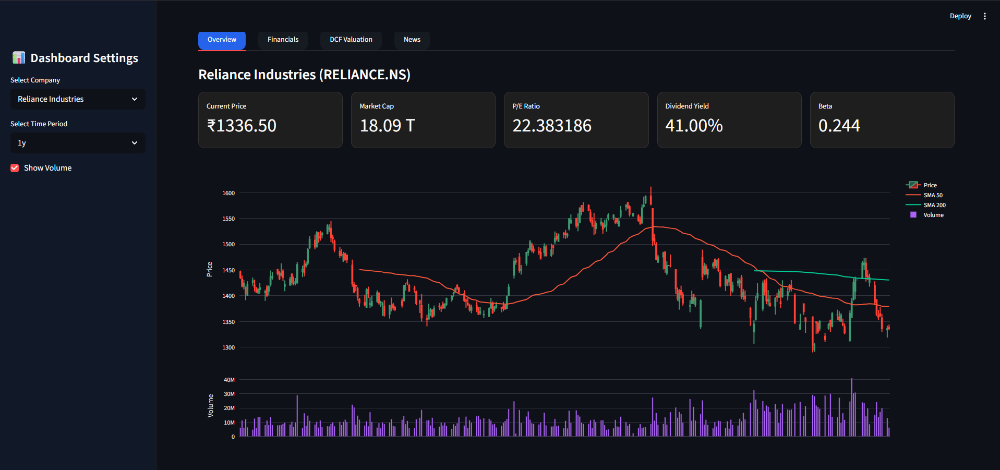
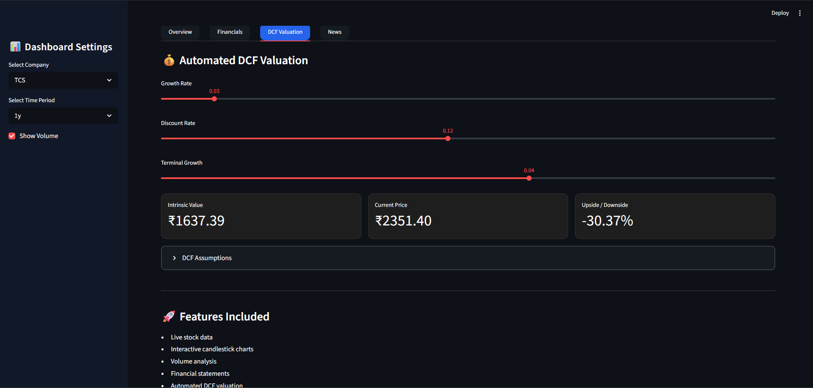

# Automated Finance Model

An AI-assisted financial analysis and valuation dashboard built using Python and Streamlit.

## Features

- Financial statement analysis
- Discounted Cash Flow (DCF) valuation
- Interactive charts and visualizations
- Ratio analysis
- Company financial overview
- Clean dashboard interface
- Real-time market data integration

---

## Tech Stack

- Python
- Streamlit
- Pandas
- Plotly
- yFinance

---

## Installation

Clone the repository:

```bash
git clone https://github.com/mohdatif-ib/automated-finance-model.git
```

Go to project folder:

```bash
cd automated-finance-model
```

Install dependencies:

```bash
pip install -r requirements.txt
```

Run the application:

```bash
streamlit run app.py
```

---

## Project Structure

```text
automated-finance-model/
│
├── app.py
├── main.py
├── requirements.txt
├── styles.py
├── utils.py
├── modules/
├── screenshots/
└── .streamlit/
```

---

## Dashboard Preview

### Main Dashboard



---

### Financial Statements


---

### DCF Valuation



---

## Future Improvements

- Portfolio tracking
- Monte Carlo simulations
- AI-generated financial summaries
- Export reports to PDF
- Multi-company comparison

---

## Author

Mohd Atif Khan

GitHub:
https://github.com/mohdatif-ib
